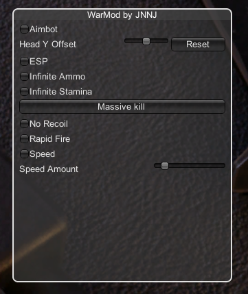

# Warmod

A simple but powerful cheat for [WarMode](https://store.steampowered.com/app/391460/WARMODE/).

## Features
- Aimbot
- Esp
- Infinite Ammo
- Infinite Stamina
- Massive Kill
- Rapid Fire
- Speed

## Installation
1. Download [BepInEx](https://github.com/BepInEx/BepInEx/releases/download/v6.0.0-pre.1/BepInEx_UnityMono_x64_6.0.0-pre.1.zip), the file name should be "BepInEx_UnityIL2CPP_x64_6.0.0-pre.1.zip".
2. Download [WarMod.dll](https://github.com/CodeName-Anti/WarMod/releases/download/download/WarMod.dll)
3. Extract the Zip archive (BepInEx file) in your WarMode Installation Folder(open Steam then Right Click Muck in your library -> Manage -> Browse local Files).
4. Start the Game and then close it once you are in the Main Menu (We do this because we need bepinex to generate some files). The Game might take some time to start on the first launch.
5. Go to the "plugins" in "WarMode/BepInEx/" (Will load after step 4) then copy the [WarMod.dll](https://github.com/CodeName-Anti/WarMod/releases/download/download/WarMod.dll) into it.
6. And you're done! Launch the game and your all set.